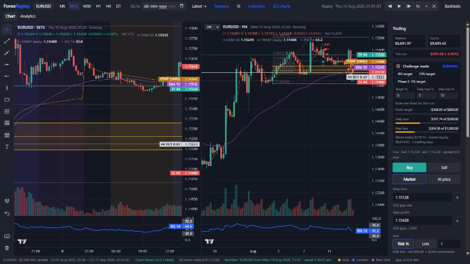
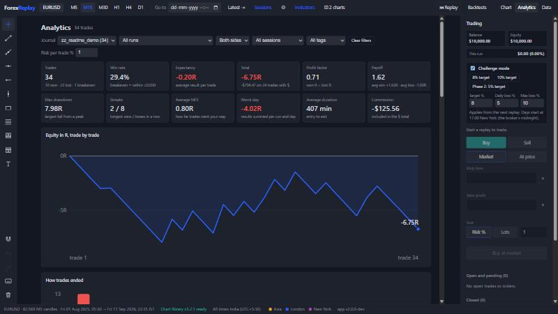
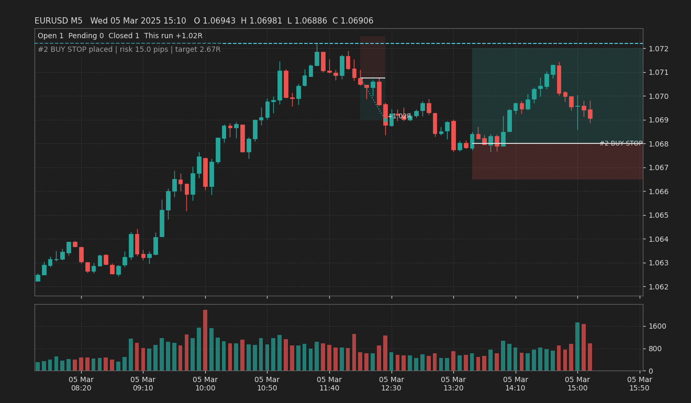

# ForexReplay

A forex **bar-replay and backtesting app** for EURUSD, in the style of TradingView's replay and FX Replay. You pick a moment in history, the future disappears, and you trade it candle by candle as if it were live. Every trade, drawing and note is saved so a session can be resumed, and every closed trade lands in a journal with R-multiple statistics.

I built it to test my own session-based trading ideas honestly, with no hindsight, before risking money on prop-firm challenges. **v2** (this README) is a browser app built in two weeks with an AI coding agent (Claude), which I directed day by day. **v1** is the earlier Python and matplotlib version, still in the repository.



*A replay in progress: M15 and H4 side by side on one replay clock, EMA 50, daily VWAP and RSI 14. A Fibonacci drawn on H4 shows its OTE zone on both charts, and the open trade's stop and target lines appear on both. Challenge mode is tracking the daily and maximum loss on the right.*

## What it does

**Replay without hindsight**
- One replay clock in M5 candles drives every timeframe (M5, M15, M30, H1, H4, D1). Higher timeframes show a forming candle that grows as M5 candles arrive.
- You can step back and look at history, but orders, closes and stop moves are only accepted at the live edge. You cannot trade a move you have already watched.
- Two charts side by side on the same clock (for example M15 and H4), with the crosshair following across.
- Session shading (Asia, London, New York, or ICT killzones), set in each city's own clock. All times are shown in India time.

**Trading as a broker would fill it**
- Market, limit and stop orders with stop loss and take profit, placed from a ticket or by clicking the chart. Stop and target lines can be dragged.
- Fills are resolved on M5 candles whatever timeframe is on screen. An order is never filled on the candle it was placed on, and when stop and target are both inside one candle, the stop is assumed hit first.
- An account in dollars: set any balance (click it), lot size from a risk %, commission ($4 per lot), partial closes, breakeven, close all.
- **ADR plan:** ADR10 worked out once a day from completed daily candles, and your thresholds (sweep penetration, buffer, minimum stop, displacement, FVG size) as multiples of it, in pips; the ticket warns when a stop is under minStop or reward:risk under your floor.
- **Prop-firm challenge mode:** profit target, daily loss limit and maximum loss, checked on every M5 candle at its worst price, with days starting at 17:00 New York.

**Drawing and analysis**
- Trendline, ray, horizontal line and ray, vertical line, rectangle, Fibonacci with the OTE zone (0.618 to 0.79) and your own levels and extensions, long/short position tool, text notes. Drawings have colours, line styles, a magnet to candle prices, undo, and TradingView-style Alt shortcuts.
- Indicators: SMA, EMA, daily VWAP, RSI, ATR and ADR (with today's ADR levels), worked out only from revealed candles.

**Backtests, journal and analytics**
- Every replay is a backtest, saved as you go and resumable later. It is saved as the actions you took and rebuilt by replaying them, then checked trade by trade against the save.
- Each trade gets a note, tags and automatic chart screenshots at entry and exit.
- The journal (`strategies/<name>/trades.csv`) has one row per closed trade: R result, MFE and MAE, session, lots, dollars, note and tags.
- An analytics page with win rate, expectancy, profit factor, drawdown, streaks, an equity curve, an R histogram, breakdowns by session, weekday, side, tag and run, and a prop-firm check.



*The analytics page, shown on a scripted test run of random trades (not a strategy).*

## Run it

You need Python (tested on 3.11) and an internet connection the first time (to download TradingView Lightweight Charts).

```bash
pip install -r requirements.txt
python -m forex_replay app        # or double-click start_app.bat on Windows
```

It opens `http://127.0.0.1:8765`. The first start builds the browser's market data from the MT5 export in `data/` (EURUSD M5, 1 Aug 2025 to 11 Sep 2026, 82,569 candles).

Then click **Replay**, click the candle to start from, and press **Space**. Press **?** in the app for every keyboard shortcut.

### Online version

`python -m forex_replay site --out _site` builds the same app as a static website (53 files, about 3 MB) for free hosting. Every push to `main` publishes it on GitHub Pages at https://jeevesh692.github.io/ForexReplay/ (public; [decision 0016](docs/decisions/0016-github-pages.md)). Online there is no Python server, so each visitor's backtests are saved in their own browser and screenshots are not kept; see [decision 0015](docs/decisions/0015-online-version.md). The site asks search engines not to list it.

## How it is tested

```bash
pip install pytest && python -m pytest    # 68 Python tests
node --test web/tests/*.test.mjs          # 134 JavaScript tests (Node.js, no packages)
```

The browser app repeats three pieces of logic that already existed in Python. Each copy is held to the Python original by a recorded comparison file, so the two can never drift apart:

| JavaScript | Held to | Comparison |
|---|---|---|
| trading engine (`web/js/broker.js`) | `forex_replay/broker.py` | 120 random scenarios, 2,079 trades, every fill and exit field by field |
| statistics (`web/js/analytics.js`) | `forex_replay/stats.py` (the `report` command) | 40 random journals, 1,138 rows, every statistic and breakdown |
| indicators (`web/js/indicators.js`) | a plain-Python writing of the same definitions | 900 candles over 5 trading days |

Other tests play 60 random trading sessions and require identical results after a save and rebuild. Higher timeframes are compared with pandas' own candles, and timeframe views are checked never to show a hidden candle. The key tests were each broken on purpose once, to check that they fail.

## How it was built

v2 was built from 27 Sep to 4 Oct 2026 with Claude, an AI coding agent, to a 14-day plan. I set the goals, made the product and trading decisions (which tools, which rules, what to leave out), tested each day's work in the app and reviewed it. Claude proposed designs, wrote the code and tests, and explained each day's work.

The record is part of the project:
- [`docs/build-log.md`](docs/build-log.md): one entry per day with what was asked, built, tested and decided, and the bugs found along the way.
- [`docs/decisions/`](docs/decisions/): 14 design records, each saying why something is the way it is and what is not done yet.
- [`docs/plan.md`](docs/plan.md): the plan and its status.

Some things the build caught by checking rather than assuming:
- **A look-ahead bug in the first indicator version.** It read past the revealed candles, so its lines ran into the hidden future. Caught in the browser; a test now fails on that code.
- **A slow replay, made 35 times faster by measuring each part.** It took 101 ms per candle and now takes about 3 ms. Most of it was the chart library's markers plugin; the trading engine took 0.01 ms.
- **An exit screenshot taken one candle early.** The engine hears about a candle before the chart draws it.

## Architecture

```
forex_replay/          Python: v1 replay and backtester, plus v2's data pipeline, server and reference fixtures
  datapipe.py          MT5 exports -> UTC monthly binary files (broker server time is New York + 7h)
  server.py            local web server (standard library): app, backtests, journals, screenshots
  backtests.py         backtest files and the journal CSV
  broker.py stats.py   the reference trading engine and statistics
  golden.py stats_golden.py indicator_golden.py   recorded comparisons for the JavaScript copies
web/                   the browser app: plain ES modules, no build step, no npm packages
  js/replay.js         the one replay clock
  js/timeframes.js     M15..D1 built from M5, with forming candles
  js/broker.js         trading engine (a rule-for-rule port of broker.py)
  js/trading.js        clock -> engine; records every action for save and rebuild
  js/account.js        money: lots, dollars, commission
  js/challenge.js      prop-firm rules
  js/backtest.js       save, rebuild, check
  js/chart.js          TradingView Lightweight Charts wrapper: India time, trade lines, markers, indicators
  js/drawings.js       drawings as time and price; geometry and hit-testing
  js/analytics.js      statistics (held to stats.py)
  js/indicators.js     SMA, EMA, RSI, VWAP (step by step during a replay)
  tests/               node --test
docs/                  build log, design records, plan, screenshots
strategies/<name>/     journals (trades.csv), saved backtests, screenshots
```

The rules the code keeps are written down in [`CLAUDE.md`](CLAUDE.md): no look-ahead, one replay clock, fills on M5, two engines held to one truth, prices as whole points, times as UTC seconds.

## Not done yet

- **Data:** one symbol (EURUSD) and one data source (an MT5 export). Many candles record zero spread, so the minimum spread setting matters.
- **Intrabar data:** a request for tick or M1 data, so candles form live inside an M5 candle, is parked (see `docs/plan.md`). Fills are honest at M5 resolution, not finer.
- **Gaps:** each design record ends with what is not done; the main ones are trailing stops, more indicators, a date filter on the analytics page, and more than two charts.

## v1: the Python version

v1 (`python -m forex_replay replay`) is a matplotlib replay window with click-to-trade, an event-driven backtester for automated strategies, a CSV journal and an R-multiple report. It still works and shares the journal format with v2.

```bash
python -m forex_replay replay --journal impulse_candle --start "2025-03-03 07:00" --spread 0.2
python -m forex_replay backtest --strategy asian_breakout --spread 0.2
python -m forex_replay report strategies/impulse_candle/trades.csv --plot equity.png
```



Results recorded with v1:

| Journal | Trades | Win rate | Expectancy | Profit factor | Max DD |
|---|---|---|---|---|---|
| Manual: impulse candle (2 replays of 3–17 Mar 2025) | 22 | 55% | −0.16R | 0.65 | 4.6R |
| Automated: Asian breakout, 0.2 pip spread (Feb 2025 – Jul 2026) | 204 | 41% | −0.02R | 0.97 | 28.6R |

The manual setup won more often than it lost, but its targets were about 0.5R, which needs a win rate near 65% just to break even. The simulator showed that after 22 trades instead of after a failed challenge. See [`notebooks/trade_review.ipynb`](notebooks/trade_review.ipynb).

---
Built by **Jeevesh Prakash**, formerly a research consultant at WorldQuant, with Claude (Anthropic) as the coding agent. Charts by [TradingView Lightweight Charts](https://github.com/tradingview/lightweight-charts) (Apache 2.0).
