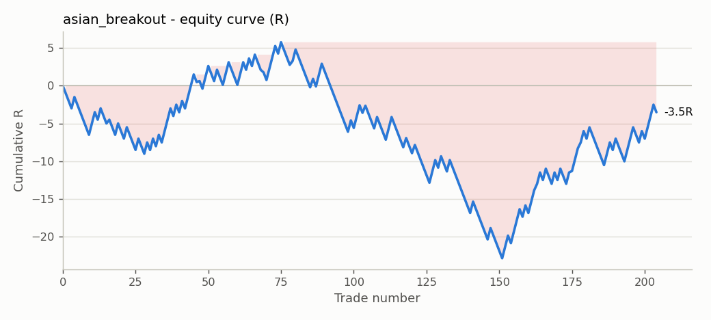

# ForexReplay

A bar-by-bar forex **replay simulator and backtester** written in Python. Replay historical EURUSD 5-minute candles one at a time, place trades by clicking on the chart, and get an automatic trade journal with R-multiple statistics. The same execution engine also runs **automated strategies** over the full dataset.

I built it to test discretionary, session-based trading ideas honestly, with no hindsight, before risking money on prop-firm challenges.


> **v2 in progress (Sep–Oct 2026):** a TradingView-style browser app built on TradingView's open-source
> Lightweight Charts, developed with an AI coding agent (Claude) over a two-week plan.
> Start it with a double-click on `start_app.bat`, or run `python -m forex_replay app`.
> Progress is tracked in the [build log](docs/build-log.md), and design choices in [docs/decisions](docs/decisions/).
> So far: data pipeline, TradingView-style chart with M5 to D1 timeframes in India time, bar replay with forming candles, configurable session shading, market/limit/stop orders with stop loss and take profit, and an account in $ with lot sizing from risk %, commission, partial close, breakeven and draggable stop and target lines, and drawing tools (trendline, horizontal line, rectangle, Fibonacci with the OTE zone, long/short position), and backtests that save as you go and resume later, with closed trades written to the journal, and a prop-firm challenge mode (profit target, daily loss limit, maximum loss).

## Features

**Replay (manual testing)**
- Candle-by-candle replay with autoplay and adjustable speed, over 100k+ EURUSD M5 candles (Feb 2025 – Jul 2026)
- Click-to-trade: market, limit and stop orders with stop loss and take profit, drawn on the chart as risk/reward boxes
- Look back through history freely; trading is only allowed at the live candle, so you can't trade a move you've already seen
- Trendlines and horizontal levels anchored to candle timestamps
- Sessions saved as readable JSON (F5 / F9)

**Execution model**
- Chart prices are bid; buys fill at the ask, with a configurable spread
- Orders only fill on candles *after* they are placed (no look-ahead)
- Gaps through a stop fill at the open (slippage shows up as losses worse than −1R)
- If stop loss and take profit are both inside one candle, the stop loss is assumed to be hit first
- On the candle a limit/stop order fills, only the stop loss can trigger, since the order of prices inside the candle is unknown

**Journal and analytics**
- Every closed trade is written to CSV: entry/exit, R result, planned reward:risk, **MFE/MAE** (how far it went for/against you), session, weekday, duration
- Statistics: win rate, expectancy, profit factor, payoff ratio, max drawdown, win/loss streaks, results by session
- Prop-firm check: converts R into account % at a chosen risk per trade and flags daily/max-loss breaches
- Analysis notebook with equity curves and breakdowns: [`notebooks/trade_review.ipynb`](notebooks/trade_review.ipynb)

**Automated backtests**
- Strategies subclass `Strategy` and receive each candle after it closes, sharing the same broker as the replay window
- Example: Asian-range breakout into the London session (`forex_replay/strategies/asian_breakout.py`)

## Quick start

```bash
pip install -r requirements.txt

# Interactive replay (trades go to strategies/impulse_candle/trades.csv)
python -m forex_replay replay --journal impulse_candle --start "2025-03-03 07:00" --spread 0.2

# Automated backtest of the example strategy
python -m forex_replay backtest --strategy asian_breakout --spread 0.2

# Statistics and an equity-curve chart for any journal
python -m forex_replay report strategies/impulse_candle/trades.csv --plot equity.png

# Tests
pip install pytest
python -m pytest
```

## Replay controls

| Key | Action | Key | Action |
|---|---|---|---|
| → / ← | next / previous candle | Space | play / pause |
| ↑ / ↓ | faster / slower | End | back to the live candle |
| B / N | new buy / sell order | Enter | market entry (while placing an order) |
| Esc | cancel current action | C | close latest open trade |
| X | cancel latest pending order | T | list active trades |
| O | statistics | I | details of hovered candle |
| L | trendline (2 clicks) | H | horizontal line (1 click) |
| Backspace | delete last drawing | Delete | clear drawings |
| F5 / F9 | save / load session | ? | help |

To place an order, press **B** or **N**, click the entry price (or press **Enter** for market), then click the stop loss, then the take profit. Whether the order is a limit or a stop is worked out from where you click relative to the current price.

## Results so far

| Journal | Trades | Win rate | Expectancy | Profit factor | Max DD |
|---|---|---|---|---|---|
| Manual: impulse candle (2 replays of 3–17 Mar 2025) | 22 | 55% | −0.16R | 0.65 | 4.6R |
| Automated: Asian breakout, 0.2 pip spread (Feb 2025 – Jul 2026) | 204 | 41% | −0.02R | 0.97 | 28.6R |

The manual setup wins more often than it loses, but its targets were about 0.5R, which needs a ~65% win rate just to break even. The simulator made that visible after 22 trades instead of after a failed challenge. See the notebook for the full analysis.



## Project structure

```
forex_replay/
  broker.py        order execution: fills, spread, SL/TP, MFE/MAE
  replay.py        replay cursor (live edge vs. history)
  gui.py           interactive matplotlib window
  chart.py         candlestick and trade rendering
  journal.py       CSV trade journal
  stats.py         performance and prop-firm statistics
  backtest.py      automated strategy runner
  strategies/      example automated strategy
  sessions.py      market-session labels
  persistence.py   JSON sessions
  plotting.py      report charts
  datapipe.py      v2: MT5 exports -> UTC monthly binary files for the browser
  server.py        v2: local web server (standard library only)
web/               v2 browser app (plain JavaScript modules, tests in web/tests)
docs/              build log and architecture decision records
tests/             unit tests for execution, stats, replay, GUI flow, data pipeline, server
notebooks/         trade analysis
data/              EURUSD M5 candles (MT5 export)
strategies/        journals from manual replay, one folder per idea
results/           automated backtest output
```

## Data notes

The candles are an MT5 export in **broker server time (UTC+2 in winter, UTC+3 in summer)**, so London opens at 10:00 and New York at 15:00 on the chart all year round. Session boundaries live in `forex_replay/sessions.py`. The export's spread column is empty, so spread is set with `--spread`.

## Roadmap

- Partial closes and moving the stop to breakeven
- Multiple symbols and timeframes (the instrument is already configurable)
- Walk-forward parameter testing for automated strategies

---
Built by **Jeevesh Prakash**, formerly a research consultant at WorldQuant.
